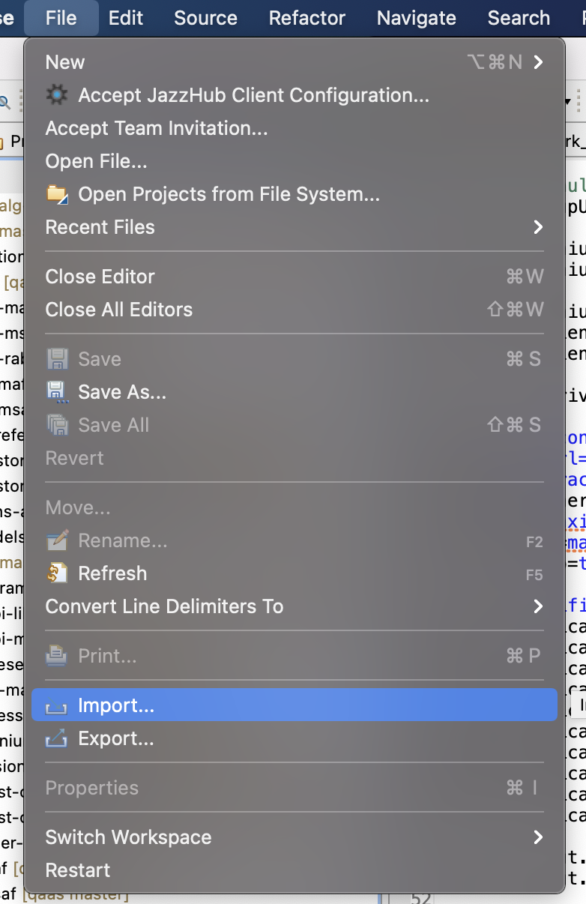
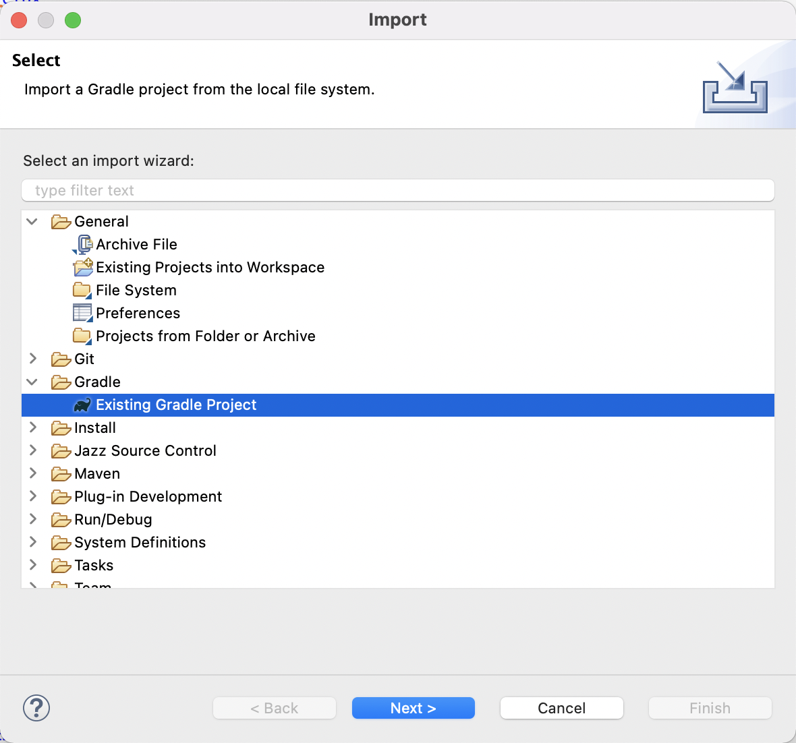
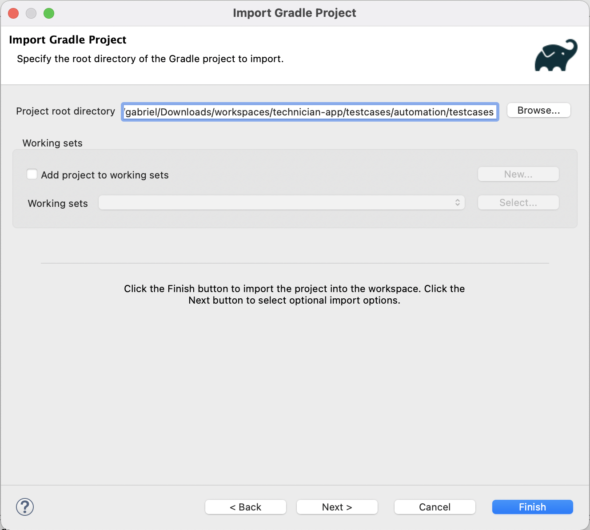

# Technician App Mobile Automation Testcases

> In order to run this set of testcases you must prepare your environment as described in [Environment Setup Instructions](https://github.ibm.com/maximo-app-framework/mobile-automation-framework/Readme.md)

> Important: this project uses the [Graphite Storybook Automation Framework](https://github.ibm.com/maximo-app-framework/graphite) located at `automation/storybook/framework`

The technician tests cases are located at `testcases/automation/testcases` directory.

## Importing the test cases on Eclipse

1. Go to `File` -> `Import`

2. Select `Existing Gradle Project`

3. Provide the `testcases/automation/testcases` directory

4. Click on `Finish`
